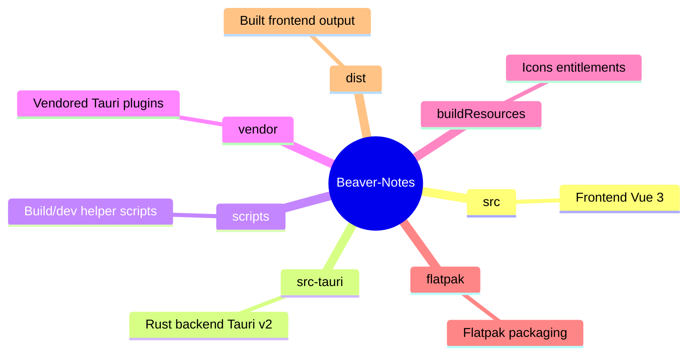
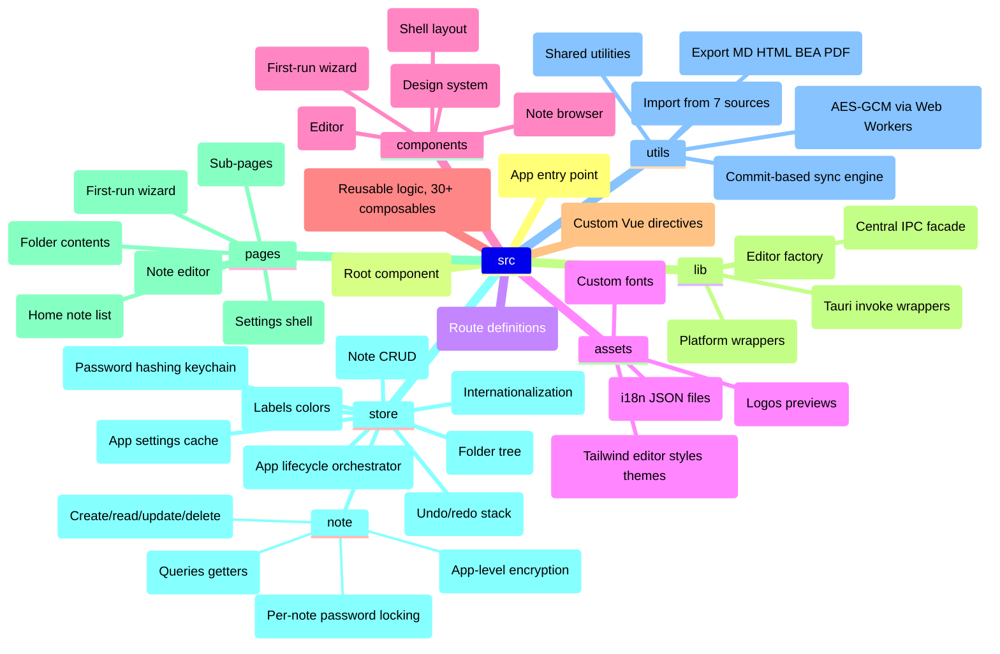
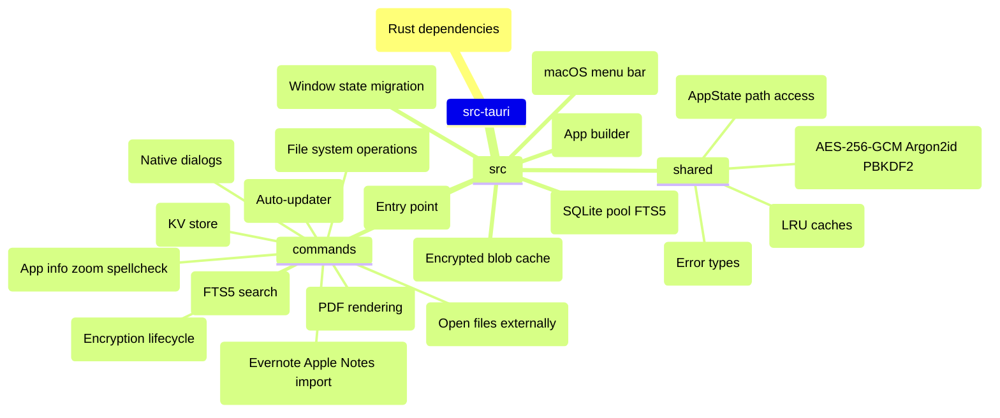
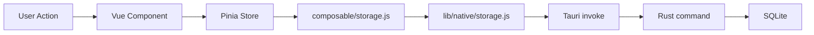
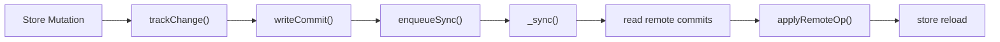
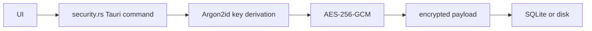

## Tech Stack

| Layer | Choice |
|---|---|
| **Desktop & Mobile Framework** | Tauri v2 |
| **Frontend** | Vue 3 (Composition API, `<script setup>`) |
| **State Management** | Pinia v3 |
| **Routing** | vue-router (hash history) |
| **Editor** | Tiptap v3 (ProseMirror-based) |
| **Build Tool** | Vite 5 |
| **CSS** | Tailwind CSS 3 + tw-colors |
| **Backend Language** | Rust |
| **Database** | SQLite (via rusqlite, WAL mode) |

## Project Structure



### src/ (Frontend)



### src-tauri/ (Rust Backend)



## Data Flow



For sync:



For crypto:



## Key Patterns

- **Hash-based routing** (`createWebHashHistory`) for Tauri compatibility
- **Platform abstraction**: `lib/tauri/` handles desktop vs mobile differences (scoped storage, dialogs, haptics)
- **Two databases**: `data.db` (notes, folders, labels) and `settings.db` (settings, sync state), both SQLite with WAL mode

  ```mermaid
  graph TD
      sql["SQLite (WAL mode)"] --> data["data.db"]
      sql --> settings["settings.db"]
      data --> notes["notes"]
      data --> folders["folders"]
      data --> labels["labels"]
      settings --> s["settings"]
      settings --> sync["sync state"]
  ```
- **Web Workers**: Crypto operations run in a 4-worker pool to avoid UI thread blocking

  ```mermaid
  flowchart LR
      A["UI Thread"] --> B["security.rs (Tauri command)"]
      B --> C["4 Worker Pool"]
      C --> D["Argon2id key derivation"]
      D --> E["AES-256-GCM"]
      E --> F["SQLite or disk"]
  ```
- **Unidirectional sync**: Mutations → `trackChange()` → commit → `enqueueSync()` (non-blocking, mutex-guarded)
- **Undo/redo**: Action stack with batch merging for bulk operations
