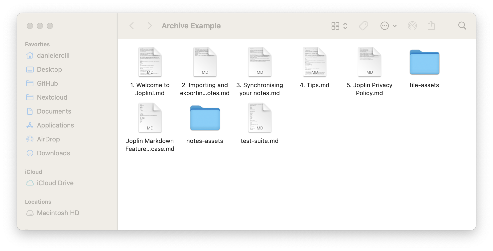
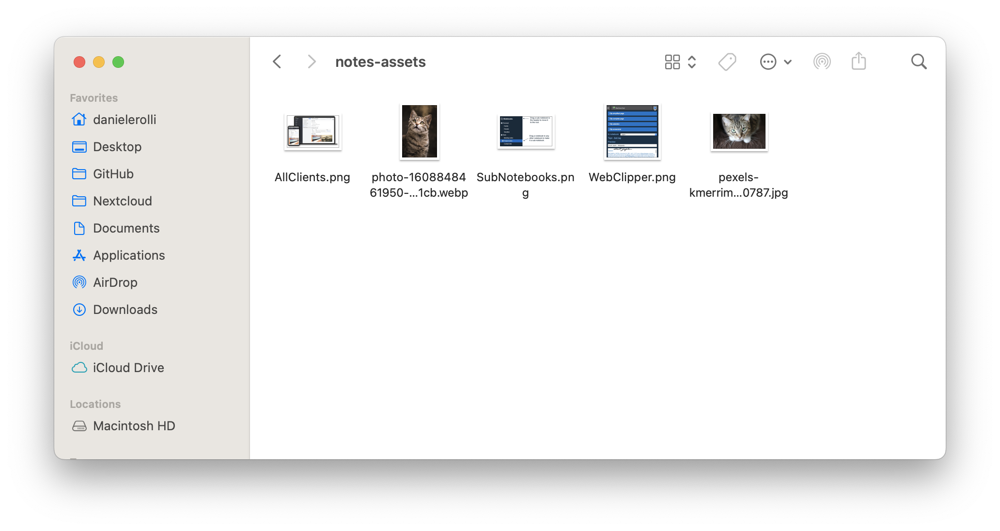
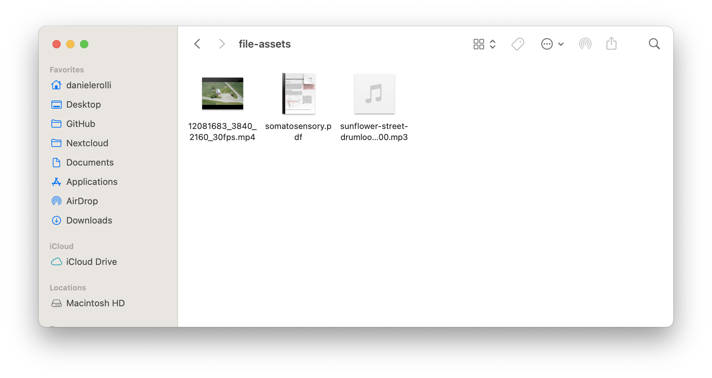

Beaver Notes 3.5.0 and later versions support importing markdown archives. To ensure a smooth import process, you need to organize your markdown archive correctly. Follow these steps to prepare and import your notes:

## 1. Creating the Archive

1. **Create a Main Folder**: Start by creating a new folder. This folder will contain all your markdown files and assets.
2. **Organize Subfolders**: Inside the main folder, create two subfolders:

   - `notes-assets` for images embedded in your notes.
   - `file-assets` for other files you may have linked.

   

## 2. Organizing Images and Files

1. **Move Images**: Place all images that are directly embedded in your notes into the `notes-assets` folder. 
Note: Images added through links should not be moved.
2. **Move Other Files**: Place all other files (e.g., attachments) into the `file-assets` folder.

   Ensure that these files are directly inside the respective folders, without any additional subfolders. Beaver Notes does not support retrieving files from nested subdirectories.

   
   

## 3. Importing the Archive

1. **Access Import Settings**: Go to `Settings > General`, then scroll down to `Import Markdown`.
2. **Select Archive**: Click the "Select Path" button and choose the main folder containing your markdown files and assets.
3. **Start Import**: Beaver Notes will begin importing your notes one by one.

   If you encounter any issues during the import, please contact us:

   - **Email**: [danielerolli@proton.me](mailto:danielerolli@proton.me)
   - **GitHub**: [Open an Issue](https://github.com/Beaver-Notes/Beaver-Notes) with a screenshot of the error.

   To help locate the error, you can enable Developer Mode from the menu bar by selecting `View > Toggle Developer Mode`, or use the following shortcuts:

   - **Mac**: `Opt + Cmd + I`
   - **Linux/Windows**: `Ctrl + Shift + I`
