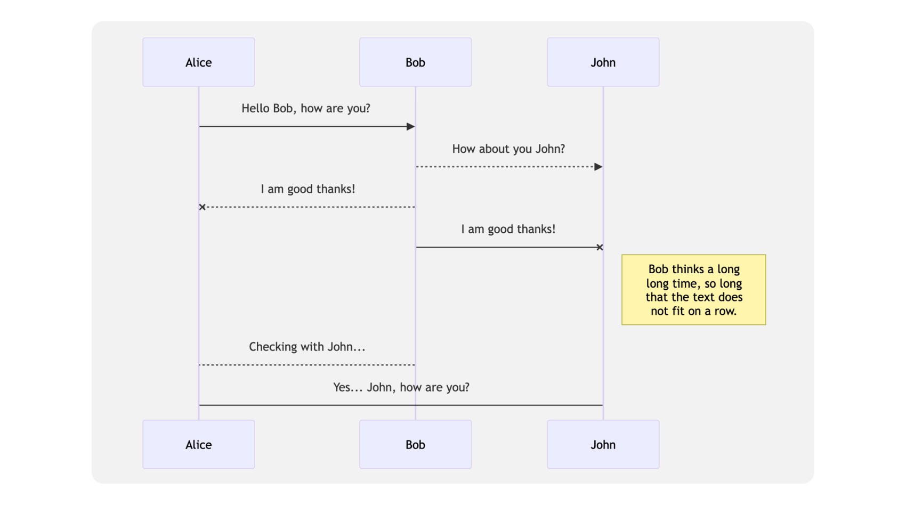

Markdown is a powerful language that helps you get things
done quickly. Master it and your notes will take shape in  > no time.

## What's Markdown

Markdown is a simple text formatting language that makes it easy to style and structure your text. You can use basic symbols, like ** and ##, to create headings, lists, links, and more. Markdown helps you focus on content without getting bogged down by complex formatting, making it a perfect tool for quick and clean writing.

## The syntax

:::info
This section of the docs doesn't cover the whole markdown syntax but only the syntax supported by Beaver Notes. If what you are trying to type isn't in here, it's probably not supported.
:::

### Headings

# Heading 1
## Heading 2
### Heading 3
#### Heading 4
##### Heading 5
##### Heading 6

### Formatting

I just love **bold text**
Italicized text is the *cat's meow*
Highlited text is the ==dog's bark==
`Inline code`
~~This text has been strikethrough~~

### Lists
1. This is an ordered list
- this is an unordered list
[ ] This is a check list
[x] This is a checked check list

## Blocks

### Quote Block

> This is a quoteblock

### Code block

To insert a code block type ``` or ~~~ followed by a space to create a code block.

:::warning
By default, VSCode doesn't support copying code with formatting. However, you can go into VSCode's settings, look for and disable 'Copy With Syntax Highlight.
:::

```python
print('This is a code block, the block below is a math block!')
```

### Math inline - inserted by typing $

$E=mc^2$

### Math Block

A math block can be inserted by typing $$. Clicking on a math block opens the KaTeX editor, while pressing Ctrl+Enter closes the editor. The math block supports KaTeX functions and is perfect for both simple and complex math once you get the hang of it.


### Mermaid Block

A mermaid block can be inserted by typing `::mermaid`. The mermaid block supports the Mermaid.js syntax, allowing you to add beautiful flowcharts, diagrams, and charts seamlessly to your notes, making data easier to read. To discover more about using Mermaid, check out the [Mermaid Block page](./The%20Mermaid%20Block.md).



### Callouts

Callouts come in yellow, red, blue, green, black, and purple.

Simply type `::color name` to insert the callout in Beaver Notes 3.3.0 or later. If you are running a previous version, you can insert a callout by typing `>[color name]`. Once added, it's ready to grab attention.

Deleting a callout is effortless—just press the delete key.

Exiting a callout is equally simple: just double press Enter. With these versatile tools, your ideas will stand out effortlessly.


### Images (from links only)


### Labels

```markdown
#Tutorial #Label
```