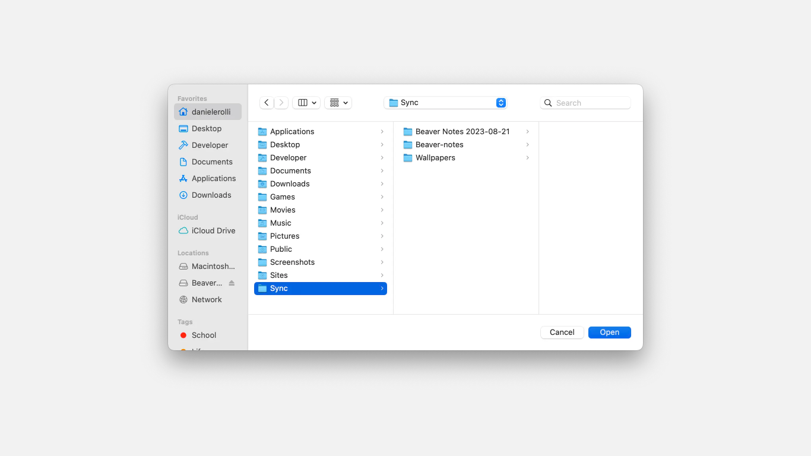

With version 0.0.7, Beaver Notes now enables you to sync data between your devices by simply selecting a path and clicking a button when needed.

:::info
Before we get started, ensure that you have a cloud provider such as Dropbox, OneDrive, iCloud, etc., installed on your PC. If you don't have a cloud provider installed on your PC, simply search **'[Your Cloud Provider Name] + Your Operating System'** on Google. Alternatively, you can also explore services like Syncthing or utilize your own server if you happen to have one.
:::

To sync your notes across devices, you'll need to choose the folder on your PC where you want your notes to be stored for synchronization. This folder should be located within a cloud provider or syncing service folder, such as iCloud, OneDrive, or Syncthing. After setting up this path, you can easily import and export your notes by clicking the corresponding buttons in the sidebar. We recommend toggling the 'import' button as soon as you open the app and doing the same with the 'export' button before concluding your note-taking session.

## Selecting the path

To choose the path, head to **Settings > General > Sync Path > Select Path**

After clicking 'Select Path,' your file manager window will open. Simply choose the folder where you want your notes to be synced.

Once you've finished selecting the path, a prompt will appear, asking you to relaunch the app for the changes to take effect. Simply press 'Relaunch,' and you're all set.

:::info
Beaver Notes 2.9.0 or later will not propt for Relaunch
:::

Kudos, you've successfully set up the synchronization! Now, all you need to do is click 'Export' in the sidebar before closing the app, and remember to toggle 'Import' as soon as you open it or you can set up auto sync.

## Auto Sync

Auto Sync takes care of keeping your notes in sync across devices. It can be enabled under Settings > General > Auto Sync. Before enabling Auto Sync, make sure you are running the latest version of Beaver and have already selected a sync path.