The mermaid block allows you to create diagrams using Mermaid.js. It supports a variety of diagram types, including flowcharts, sequence diagrams, class diagrams, state diagrams, Gantt charts, and more.

To insert a mermaid block, type `::mermaid` in the editor and press enter. A blank block will appear. By clicking on it, you'll be able to edit its contents, much like with the math block.

## Flowcharts

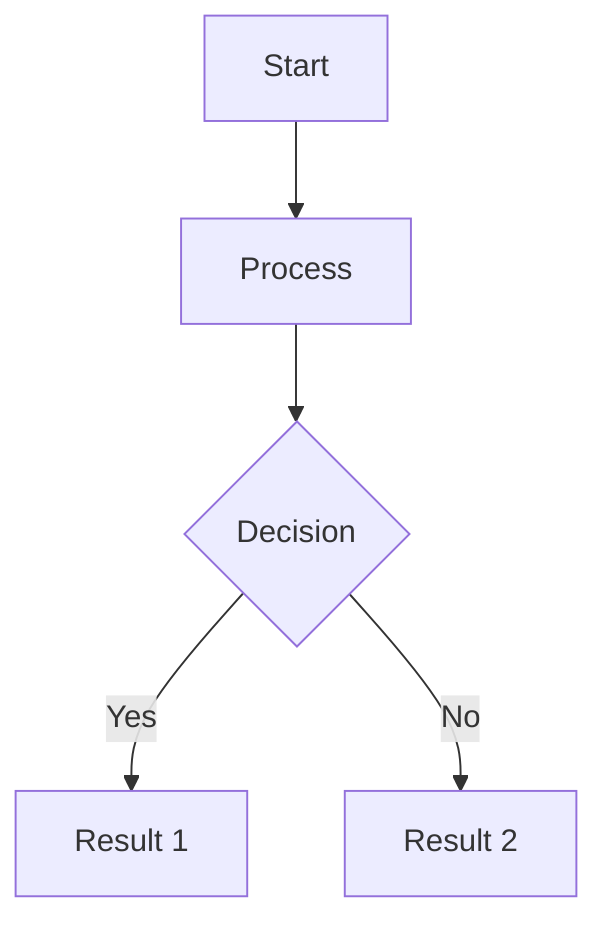

- `graph D` specifies the direction of the flowchart (top to bottom in this case). You can also use `LR for left to right`, `RL for right to left`, and `BT for bottom to top`.
- `A[Start]` creates a node labeled "Start".
- `-->` creates a directed link from one node to another.
- `{Decision}` creates a decision node (diamond-shaped).
- `--> |Yes|` creates a conditional link labeled "Yes".

## Sequence Diagrams

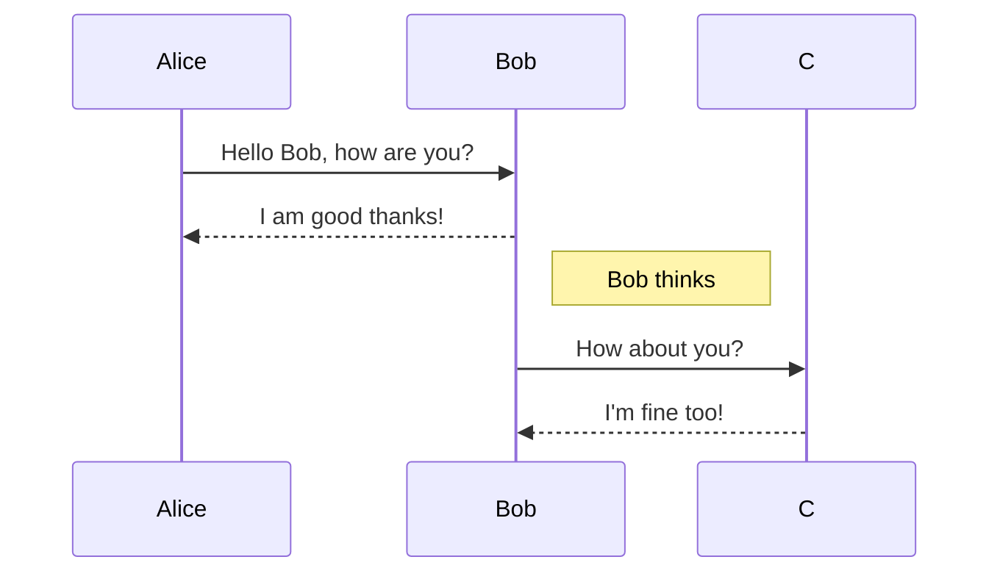

- `sequenceDiagram` specifies the start of a sequence diagram.
- `participant A` as Alice defines a participant with a display name.
- `A->>B: Message` sends a message from A to B.
- `Note right of B` adds a note to the right of participant B.

## Advanced Sequence Diagrams

Sequence diagrams can be enhanced with loops, alternatives (alt), and options (opt).

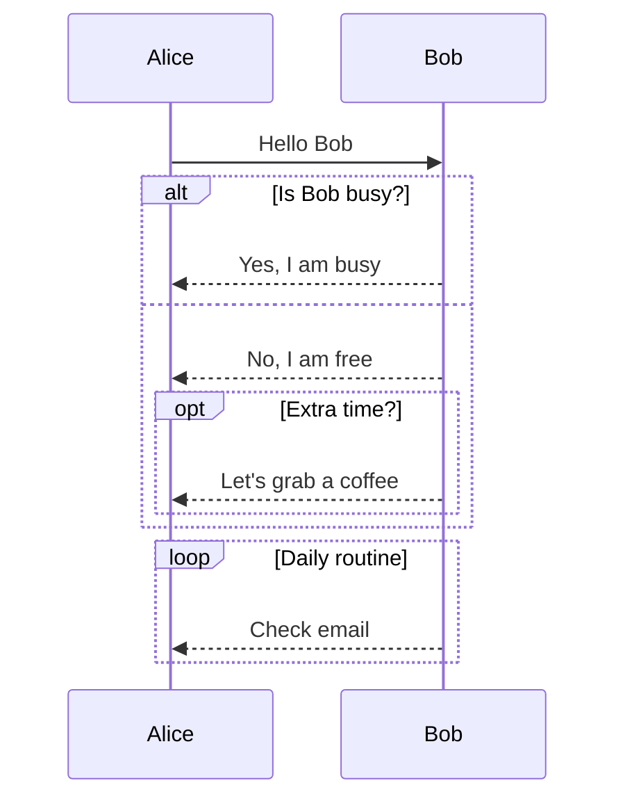

- `alt ... else` creates an alternative block with conditions.
- `opt` creates an optional block.
- `loop` creates a loop block.

## Class Diagrams

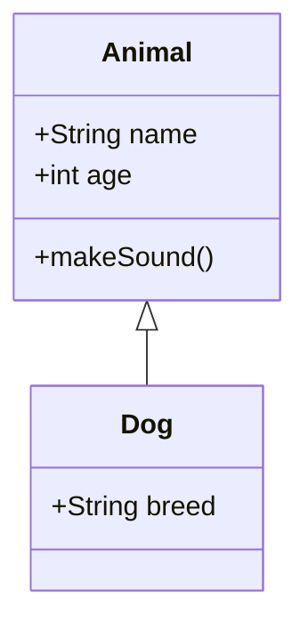

- `classDiagram` specifies the start of a class diagram.
- `class Animal {}` defines a class named Animal.
- `+String name` defines a public attribute.
- `+makeSound()` defines a public method.
- `Animal <-- Dog` indicates inheritance, where Dog inherits from Animal.

## State Diagrams

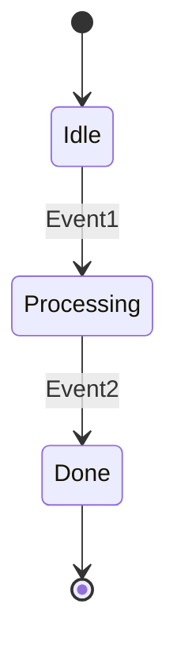

- `stateDiagram` specifies the start of a state diagram.
- `[ * ]` represents the start state.
- `Idle --> Processing : Event1` defines a transition from Idle to Processing triggered by Event1.

## Gantt Charts

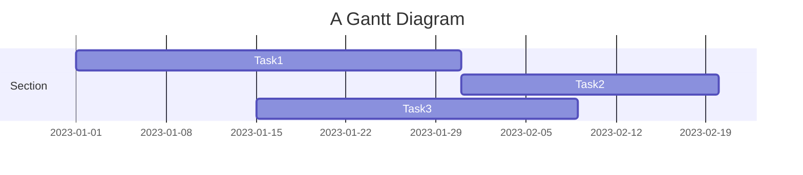

- `gantt` specifies the start of a Gantt chart.
- `title` sets the title of the chart.
- `dateFormat` specifies the date format.
- `section` defines a section of tasks.
- `Task1 :a1, 2023-01-01, 30d` defines a task with an `ID, start date, and duration.`
- `:after a1` schedules the task to start after task a1 completes.

## Pie Charts

Pie charts are used to represent data in a circular graph.

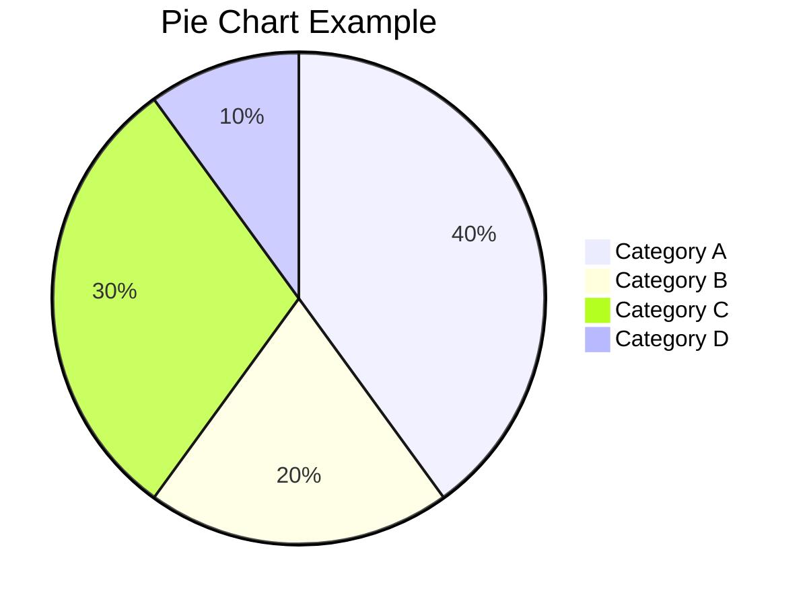

- `pie` specifies the start of a pie chart.
- `title` sets the title of the chart.
- `"Category A" : 40` defines a segment of the pie chart with a `label and value`.

## Entity Relationship Diagrams (ERD)

ERDs are used to represent the relationships between entities in a database.

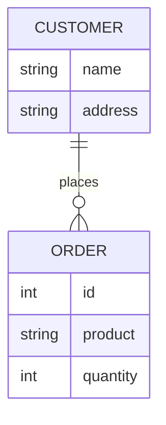

- `erDiagram` specifies the start of an ER diagram.
- `CUSTOMER ||--o{ ORDER : places` defines a relationship where a customer places orders.
- `CUSTOMER {}` defines an entity with attributes.
- `int id` defines an attribute with a type.

## Commit Flow Diagram

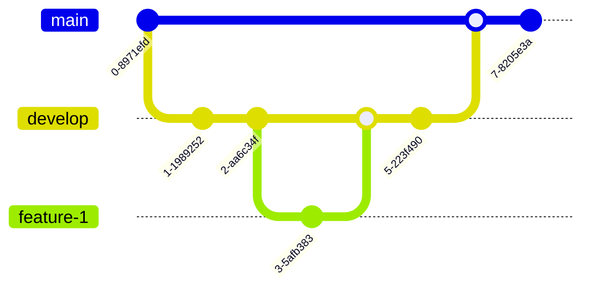

- `gitGraph` specifies the start of a commit flow diagram.
- `commit` creates a commit.
- `branch develop` creates a new branch named develop.
- `checkout develop` switches to the develop branch.
- `merge feature-1` merges the `feature-1` branch into the `current branch`.

## User Journey Diagram

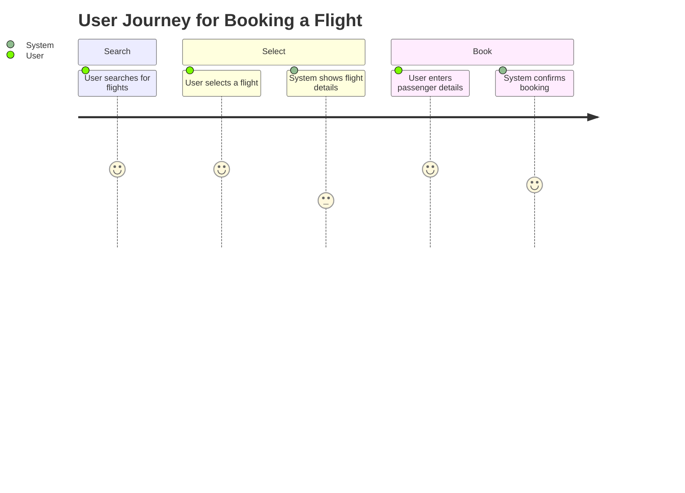
- `journey` specifies the start of a user journey diagram.
- `section` creates a new section in the journey.
- `User searches for flights: 5: User` describes an action, a `rating, and an actor`.

## Quadrant Chart

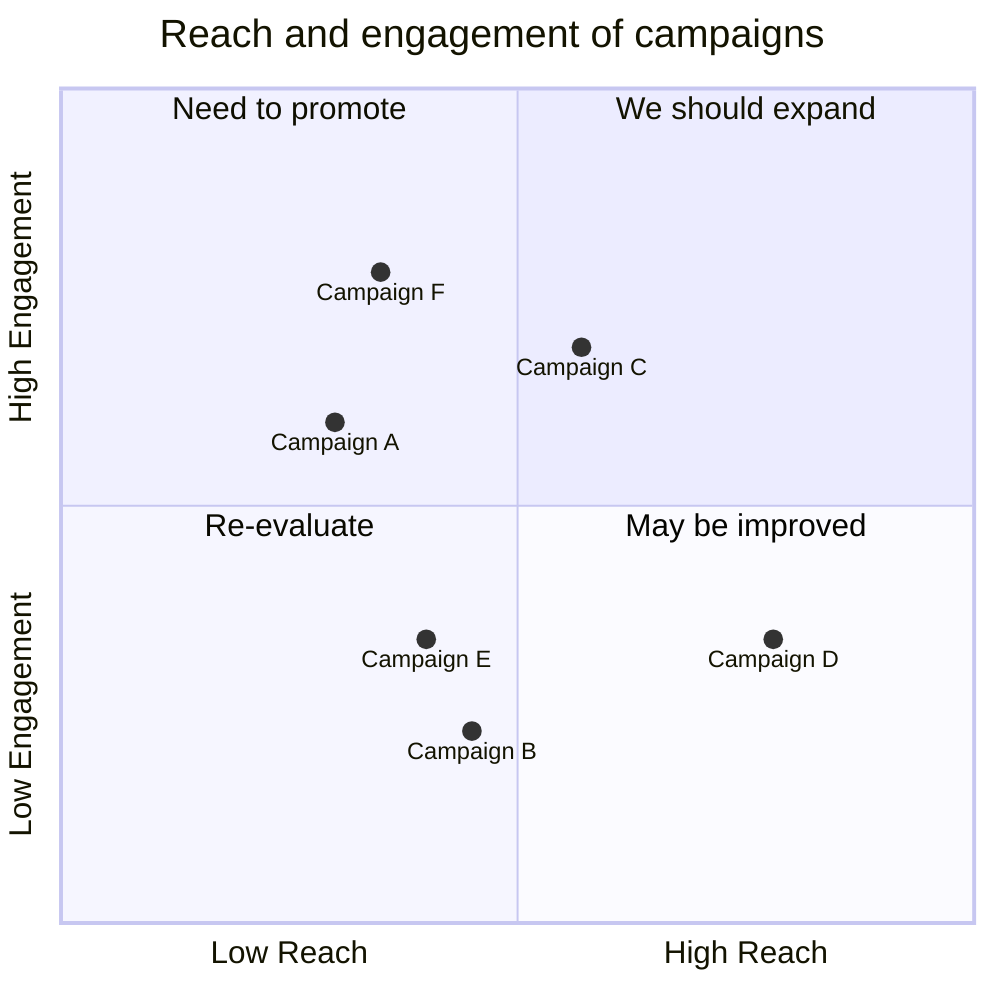
- `quadrantChart` specifies the start of a quadrant chart.
- `title Reach and Engagement of Campaigns` sets the title of the chart.
- `x-axis Low Reach --> High Reach` labels the `x-axis` with a range.
- `y-axis Low Engagement --> High Engagement labels` the `y-axis` with a range.
- `quadrant-1: We should expand` to `quadrant-4: May be improved` label the four quadrants.
- `"Campaign A" : [0.3, 0.6]` plots a point representing Campaign A with specific coordinates.

## XY Chart (XYChart-Beta)

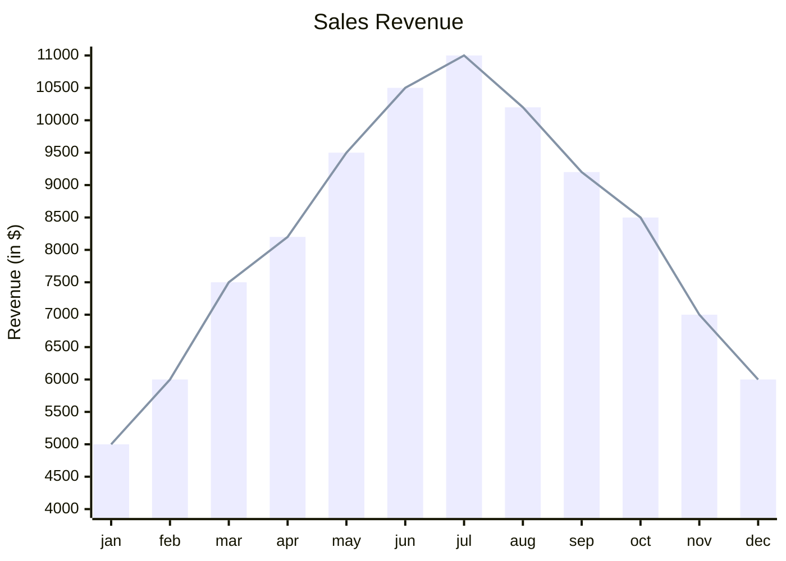

- `xychart-beta` specifies the start of an XY chart.
- `title "Sales Revenue"` sets the title of the chart.
- `x-axis [jan, feb, mar, apr, may, jun, jul, aug, sep, oct, nov, dec]` labels the x-axis with months.
- `y-axis "Revenue (in $)" 4000 --> 11000` labels the y-axis with a range for revenue.
- `bar [5000, 6000, 7500, 8200, 9500, 10500, 11000, 10200, 9200, 8500, 7000, 6000]` plots a bar chart with the given data points.
- `line [5000, 6000, 7500, 8200, 9500, 10500, 11000, 10200, 9200, 8500, 7000, 6000]` plots a line chart with the same data points.